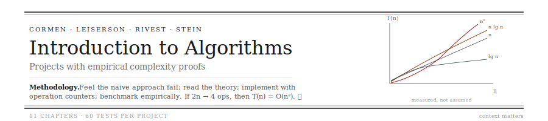
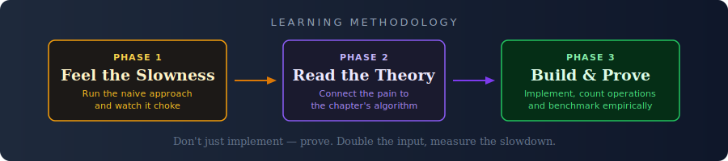

<p align="center">
  
</p>

> Selection sort on 20,000 elements: 14.3 seconds. Python's built-in sort on the same data: 0.003 seconds. Same input, same output. The difference is the algorithm. — *Chapter 2, Phase 1*

This repo turns CLRS (*Introduction to Algorithms*) into projects you build and benchmark. The twist: you don't just implement algorithms — you instrument them with operation counters and **prove their complexity empirically**. Double the input, watch comparisons quadruple? That's O(n²), and you measured it yourself.

<p align="center">
  
</p>

---

## How It Works

**Phase 1 — Feel the Problem.** A script runs the naive approach on a large input and lets you watch it suffer. Selection sort on 20,000 elements takes 14 seconds. A brute-force search takes minutes. You feel the pain that the chapter's algorithm exists to solve.

**Phase 2 — Read.** Guided reading that connects the performance gap to specific textbook sections. You already know *why* merge sort matters — you just watched selection sort choke.

**Phase 3 — Build.** TODO-scaffolded implementation with operation counting baked in. Every sort counts its comparisons. Every graph search counts its edge relaxations. The test suite doesn't just check correctness — it verifies *performance properties*:

```
test_basic.py       →  Does it sort correctly?
test_edges.py       →  Empty input, duplicates, negatives?
test_hard.py        →  Does doubling n quadruple comparisons? (O(n²) proof)
test_properties.py  →  Does merge sort beat insertion on large random input?
                        Does insertion beat merge on sorted input?
```

---

## Chapters

| | Project | What You Build | Tests |
|---|---|---|---|
| **Ch 2** | [Sort Lab](ch2-sort-lab/) | Insertion sort · merge sort · operation counting · execution tracer · benchmark runner · head-to-head comparison | 60 |
| **Ch 4** | Divide & Conquer Toolkit | Max subarray (brute → D&C → Kadane) · Strassen's matrix multiply | — |
| **Ch 6** | Priority Engine | Binary heap · heapsort · task scheduler | — |
| **Ch 7** | Quicksort Lab | Three pivot strategies · worst-case demonstration | — |
| **Ch 8** | Linear Sort | Counting sort · radix sort · breaking the O(n log n) barrier | — |
| **Ch 11** | Hash Engine | Chaining · open addressing · dynamic resizing · tombstone deletion | — |
| **Ch 12-13** | Balanced Tree | BST → red-black tree upgrade path | — |
| **Ch 14** | DP Solver | Rod cutting · LCS · generic memoization framework | — |
| **Ch 15** | Greedy Scheduler | Activity selection · Huffman coding | — |
| **Ch 20** | Graph Explorer | BFS · DFS · topological sort · maze solver | — |
| **Ch 22** | Route Planner | Dijkstra · Bellman-Ford · negative cycle detection | — |

## Chapter 2: Sort Lab

Phase 1 shows selection sort struggling on 20,000 elements while Python's built-in finishes instantly. It counts operations: 5x more data → 25x more comparisons — the O(n²) signature.

After reading, you implement 5 functions:

```
TODO 1: Insertion Sort        → with comparison and swap counting
TODO 2: Merge Sort            → with comparison, copy, and recursion counting
TODO 3: Execution Tracer      → step-by-step trace showing array state after each operation
TODO 4: Benchmark Runner      → time algorithms on random, sorted, reverse, duplicate inputs
TODO 5: Comparison Report     → head-to-head on identical data, proving when each wins
```

The Chapter 2 punchline, proven by your own benchmarks:

- Insertion sort: **O(n)** on sorted input, **O(n²)** on reverse — *measured*
- Merge sort: **O(n log n)** regardless of input — *measured*
- On sorted input, insertion sort **beats** merge sort
- On large random input, merge sort **dominates**
- There is no single "best" algorithm. **Context matters.**

```bash
cd ch2-sort-lab
pip install pytest

python feel_the_problem.py    # Watch selection sort struggle
# Read Chapter 2 with reading_guide.md
pytest tests/ -v              # Build until all 60 tests pass
```

## The Benchmarking Thread

Every chapter adds to a growing performance portfolio. By the end of the book, you'll have empirical proof of every algorithm's behavior — measured on your machine, from your implementations. Not textbook claims. Your data.

## Part of a Larger System

| Repo | Domain | Method |
|---|---|---|
| **This repo** | Algorithms | Feel the slowness → Read → Build and benchmark |
| [stallings-security](https://github.com/NikolasNeofytou/stallings-security) | Computer Security | Feel the attack → Read → Build the defense |
| [cfo-microeconomics](https://github.com/NikolasNeofytou/cfo-microeconomics) | Economics | Puzzle → Read → Model → Debate → Data |
